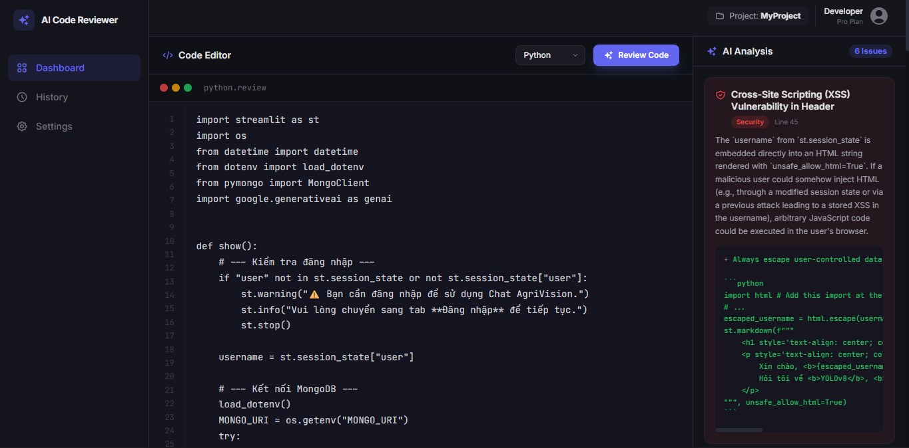

# AI Code Reviewer



## Giới thiệu
AI Code Reviewer là một hệ thống đánh giá mã nguồn thông minh sử dụng sức mạnh của trí tuệ nhân tạo (Google Gemini API). Ứng dụng cung cấp các nhận xét chi tiết, phát hiện lỗi, đưa ra các đề xuất cải thiện, và giúp lập trình viên tối ưu hoá code của mình một cách hoàn toàn tự động.

## Các tính năng nổi bật
- 🤖 **Đánh giá code tự động bằng AI**: Gửi mã nguồn lên và nhận lại các nhận xét chi tiết, phát hiện lỗi tiềm ẩn hoặc code smells nhờ vào Gemini API.
- 🛠 **Đề xuất phương án tối ưu**: Không chỉ tìm lỗi, hệ thống còn gợi ý cách để viết code ngắn gọn, rõ ràng và hiệu suất cao hơn.
- ⚡ **Áp dụng tự động (Apply All Fixes)**: Chức năng tự động áp dụng toàn bộ các bản sửa lỗi được đề xuất trực tiếp vào trong đoạn code của bạn.
- 🎨 **Giao diện hiện đại, trực quan**: Xây dựng dựa trên Next.js và TailwindCSS, tối ưu hoá trải nghiệm cho người dùng.
- 📝 **Code Editor tích hợp**: Nhập và chỉnh sửa mã nguồn một cách nhanh chóng ngay trên website.

## Yêu cầu hệ thống
- Node.js bản 18.x trở lên
- Trình quản lý gói `npm`, `yarn`, hoặc `pnpm`

## Cách chạy dự án trên máy cá nhân

1. **Cài đặt các gói phụ thuộc (Dependencies)**
   Mở terminal tại thư mục gốc của dự án và chạy:
   ```bash
   npm install
   ```

2. **Thiết lập biến môi trường (Environment Variables)**
   Tạo một file có tên là `.env.local` ở thư mục gốc của dự án (`D:\Workspace\ai\ai-code-review\.env.local`) và thêm nội dung sau:
   ```env
   GEMINI_API_KEY=your_api_key_here
   ```
   *(Xem hướng dẫn lấy API key bên dưới)*

3. **Khởi động Development Server**
   ```bash
   npm run dev
   ```
   Sau khi server khởi động thành công, hãy mở trình duyệt và truy cập vào địa chỉ [http://localhost:3000](http://localhost:3000) để sử dụng ứng dụng.

## Hướng dẫn lấy Google Gemini API Key

Để hệ thống AI có thể hoạt động, bạn sẽ cần một API Key từ dự án Google Gemini. Dưới đây là các bước để lấy API key hoàn toàn miễn phí:

1. Truy cập vào trang chủ của [Google AI Studio](https://aistudio.google.com/app/apikey).
2. Đăng nhập bằng tài khoản Google của bạn.
3. Ở thanh tác vụ / menu chọn **"Get API key"** hoặc click vào nút **"Create API Key"**.
4. Chọn "Create API key in new project" (Tạo khóa API trong dự án mới) hoặc chọn một dự án Google Cloud có sẵn của bạn.
5. Khi hệ thống sinh ra một chuỗi ký tự dài, hãy **Copy** đoạn mã đó.
6. Dán đoạn mã vừa copy vào file `.env.local` ở biến `GEMINI_API_KEY=` là hoàn tất.
